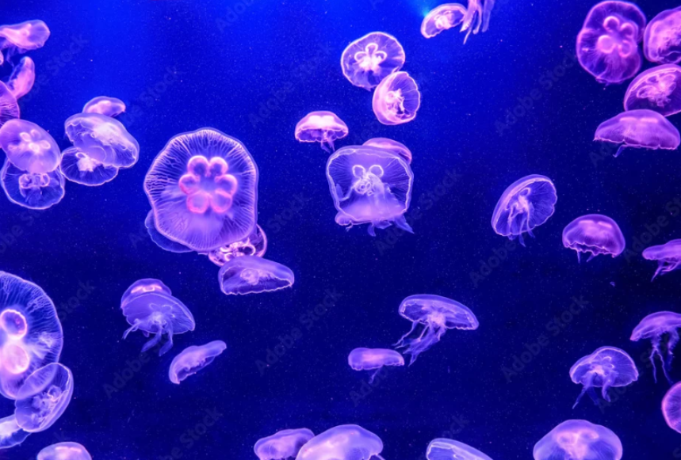

"개발자 진짜 다 짤리는 거 아니야?"

점심시간, 동료가 폰 화면을 내밀었다.  
AI가 혼자 만든 웹 데모 영상.

> "이거 프롬프트 하나로 나왔대."

숟가락이 멈췄다.

요즘 유튜브를 켜면 숨이 막힌다.  
"이제 코딩 공부하지 마세요", "개발자 99%는 대체됩니다."  
자극적인 썸네일들이 알고리즘을 타고 매일같이 사형 선고를 내린다.

개발자가 되기 위해 감내했던 고통.  
수없는 불면의 밤과 좌절, 그리고 환희.  
그 뜨거웠던 경험의 총합이 단숨에 무의미해졌다.  
코딩의 'ㅋ'도 모르는 자가 누른 가벼운 '딸깍' 한 번에.

단순한 밥그릇 문제가 아니다.  
개발자로서 버텨온 시간, 정체성이 철저히 부정당하는 느낌이었다.

지독한 무력감 끝에 오기가 생겼다.  
알고리즘이 만든 공포. 더 이상 휘둘리고 싶지 않았다.

직접 확인하고 싶었다.  
이것이 단순한 조회수용 공포 마케팅인지.  
아니면 당장 내 목을 겨눈 진짜 미래인지.  
AI한테 내가 전혀 모르는 영역을 시키면, 진짜로 '딸깍'으로 되는 건지.  
그래서 직접 해보기로 했다.

## 의도적 무지

예전부터 관심은 있었지만, 단 한 번도 배워본 적 없는 3D 프로그래밍.  
완벽한 무지(無知)의 상태.  
목표는 심해를 유영하는 3D 해파리 모델링.  
Google에서 해파리 사진을 하나 저장했다. `jellyfish.png`

_jellyfish.png_

터미널을 켰다.  
"jellyfish.png 참고해서 3D 해파리 모델링 프로그래밍 해줘"

AI가 토해낸 결과물은 단숨에 천 줄을 넘기는 방대한 코드 덩어리와, 알수없는 정체불명의 GLSL Shader 파일 11개.  
압도적이었다. 하지만 문제는 따로 있었다.  
이 방대한 코드가 쓰레기인지 정답인지, 나로서는 판독할 길이 없다는 것.

## Trash in, Trash out

화면을 띄워보니 기괴하게 꿈틀거리는 무언가가 나오긴 했다.  
하지만 이게 '해파리'인지, '해파리의 탈을 쓴 괴물'인지 알 수 없었다.  
3D 관련 지식이 없으니 제대로 된 지시도 불가능했다.

"좀 더 자연스럽게."  
"아니, 그거 말고."  
내가 줄 수 있는 피드백의 전부였다. 철저히 무력했다.

기적은 없었다. 버그가 쏟아졌다. 해파리 촉수가 기괴하게 비틀렸다.  
"좀 이상하게 도는데."  
'Parallel Transport'라는 개념 자체를 모를 때 줄 수 있는 최선의, 그리고 최악의 피드백이었다.  
물리 엔진의 속도가 발산했다. 어거지로 하드코딩을 발라 막았다.  
다음 날 'Verlet Integration'을 밑바닥부터 공부하고 나서야 진짜 원인을 도려내고 땜빵을 걷어낼 수 있었다.

> Trash in, Trash out. 내가 모호하면 AI도 모호해진다.

## Middle-out

결국 공부해야 했다. 문제는 방식이었다.

첫 번째는 Bottom-up 접근. 3D 프로그래밍을 바닥부터, 선형대수와 WebGL 명세서부터 차근차근 시작하는 정석의 방법이다.  
하지만 당장 눈앞에서 해파리가 비틀리고 렌더링이 깨져나가는데, 두꺼운 교과서를 펼치고 있을 여유 따윈 없었다.

두 번째는 Top-down 접근. AI가 뱉어낸 완성된 결과물에서 출발해, 코드를 역추적하며 짜맞추는 방법이다.  
하지만 이는 또 다른 모호함을 낳을 뿐, 영원히 AI에 끌려다니는 눈먼 소비자로 남는 지름길이었다.

내가 택한 건 Middle-out 접근이었다.  
5년 차 풀스택 개발자의 경험치. 내가 이미 쥐고 있는 확실한 무기인 'React'를 중심에 꽂아두고 시작했다.  
모든 걸 바닥부터 쌓아 올릴 시간은 없었다. 한계에 부딪힐 때만 정확히 필요한 지식을 수혈했다.

이해할 수 없는 3D 렌더링 버그가 터지면, Udemy를 켜서 GLSL 셰이더 강의를 뒤졌다.  
전체를 공부하지 않았다. 당장의 문제를 해결할 딱 그만큼의 지식만 흡수해 코드를 고쳤다.  
밑바닥부터 훑지도, 위에서부터 대충 베끼지도 않았다. 내가 가진 무기를 벼려내기 위해, 필요한 순간에 필요한 지식만 가져다 쓰는 방식이었다.

벽에 부딪혀가며 지식을 밀어 넣을수록, 질문이 날카로워졌다.  
"왜 안 보여?"가 "Transmission 렌더 패스에서 transparent 속성이 누락된 거 아냐?"로 바뀌었다.  
질문의 해상도가 높아지니 남들이 짜놓은 WebGL Water 셰이더의 주석이 눈에 들어오기 시작했다.

> 정확한 질문만이 정확한 결과를 만들어낸다.

## 5주, 47커밋

돌아보면 내 학습은 Top-down도 Bottom-up도 아니었다.  
WebGL을 처음부터 훑지도 않았고, 선형대수 교과서를 펴지도 않았다.  
이미 아는 지점 — React — 에서 시작해서, 부딪힐 때마다 위(WebGL, GLSL)로도 아래(선형대수, 물리 시뮬레이션)로도 뻗어 나갔다.  
내가 이미 아는 것이 고삐가 되고, 모르는 것이 방향이 됐다.  
Middle-out. 필요에 의한 학습이었다.

<video src="/blog/water-caustics-final.mp4" autoplay loop muted playsinline class="blog-video"></video>

**GitHub**: [diver-jay/r3f-drei-water-caustics-effect](https://github.com/diver-jay/r3f-drei-water-caustics-effect)

두려움은 모호함에서 왔다. 직접 해보니 모호함이 사라졌다.  
AI는 내가 모르는 걸 대신 짜주지만, 내가 모르면 "그거 말고"밖에 할 수 없다.

> 대체되는 건 코드를 치는 손이지, 무엇을 만들지 판단하는 머리가 아니었다.

앞으로의 기술 변화가, 이제는 두렵지 않고 선명하게 기대된다.
